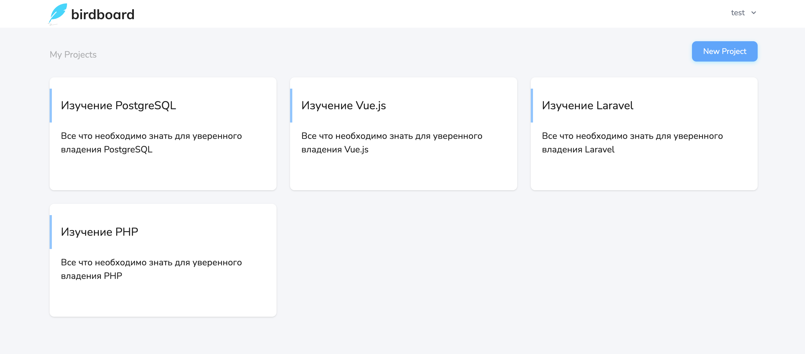

# Введение

Приложение **Laracasts Birdboard** представляет собой упрощенную реализацию инструментов для управления проектами и задачами.

Зарегистрированные пользователи могут:
- Создавать проекты
- Добавлять задачи
- Завершать задачи
- Приглашать других пользователей для участия в проектах

Приложение создано в рамках курса [Build A Laravel App With TDD](https://laracasts.com/series/build-a-laravel-app-with-tdd).

---

[Установка >>](../02-setup/README.md) | [**К оглавлению**](../README.md)
