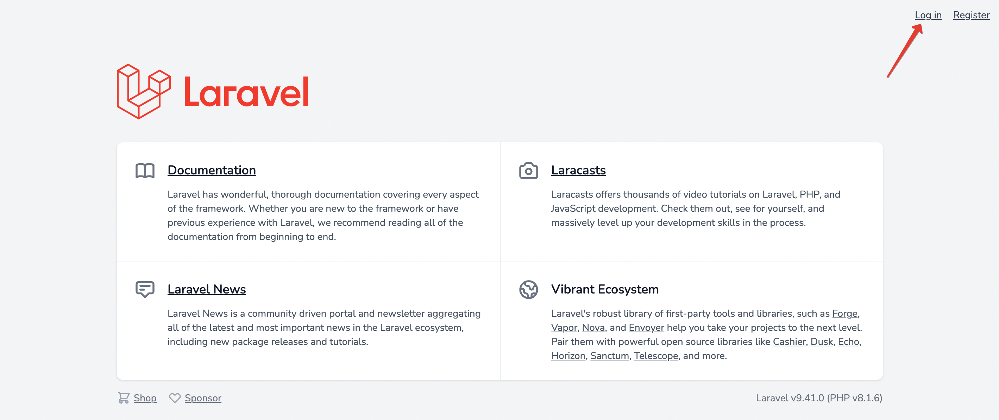
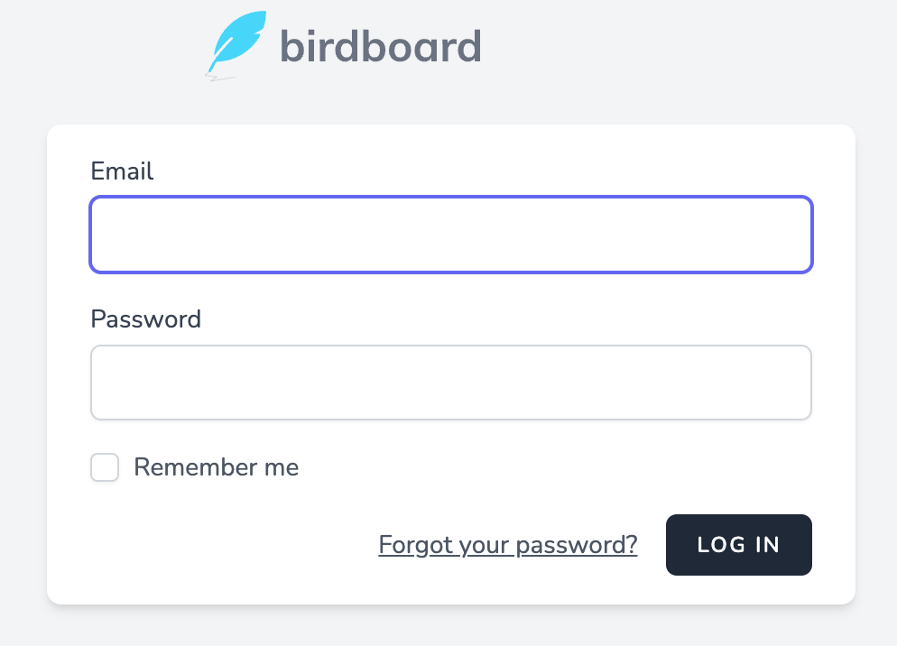
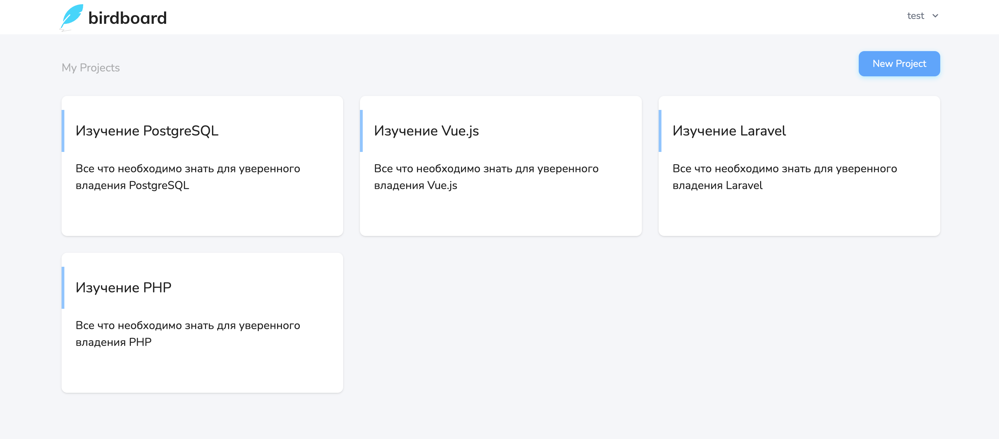

# Аутентификация

Ссылка на аутентификацию (*login*) расположена в шапке приложения:

По клику открывается отдельная страница с формой:

Если учетная запись была подтверждена ранее, то после успешной аутентификации происходит переадресация на страницу проектов пользователя:

---

[<< Регистрация](../04-registration/README.md) | [Сброс пароля >>](../06-forgot/README.md) | [**К оглавлению**](../README.md)
