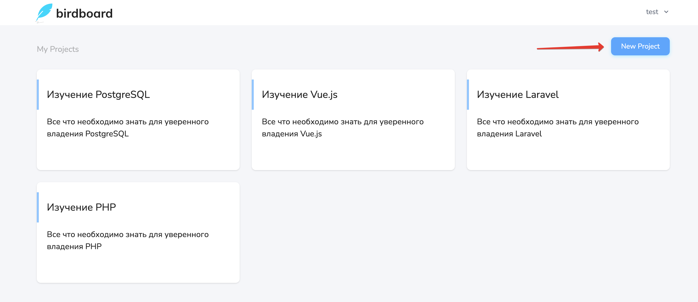
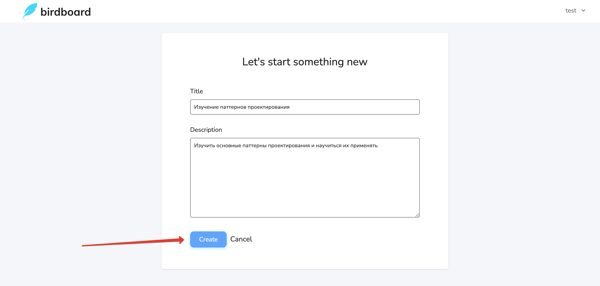
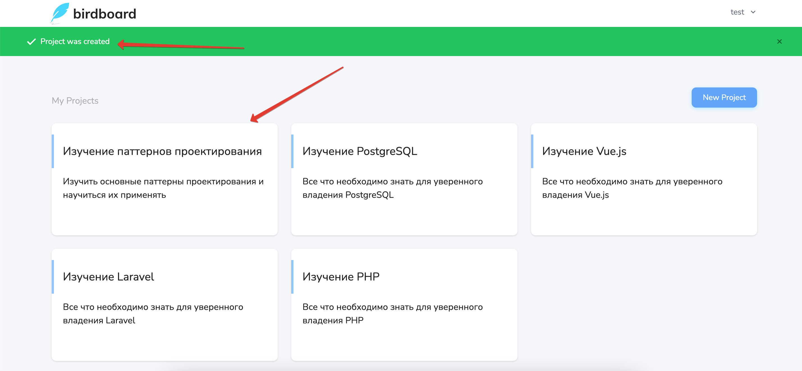

# Создание проекта

Создать новый проект можно на странице проектов пользователя:

На открывшейся странице нужно указать *название* (краткое изложение цели) и *описание* (расширенное описание, более точно излагающее суть) проекта.
Оба поля обязательны для заполнения:

После создания проекта, он появится в списке всех проектов пользователя:

