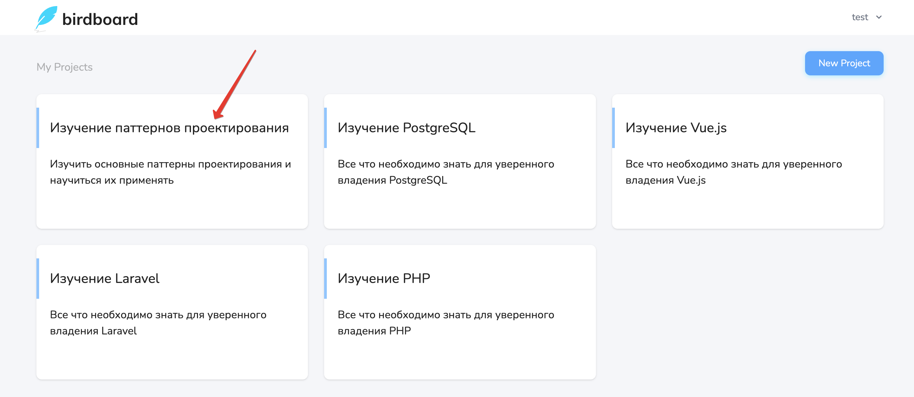
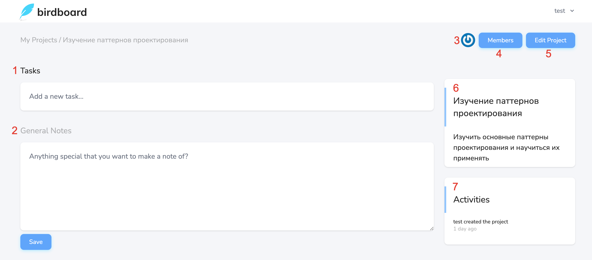

# Просмотр проекта

Для просмотра проекта необходимо кликнуть по его названию на странице всех проектов пользователя:

Откроется страница проекта:

1) Список задач проекта
2) Заметка о проекте
3) Список участников проекта
4) Переход на страницу управления участниками
5) Редактирование проекта
6) Описание проекта
7) Активности по проекту

---

[<< Создание проекта](../07-create-project/README.md) | [Управление задачами >>](../09-manage-tasks/README.md) | [**К оглавлению**](../README.md)
