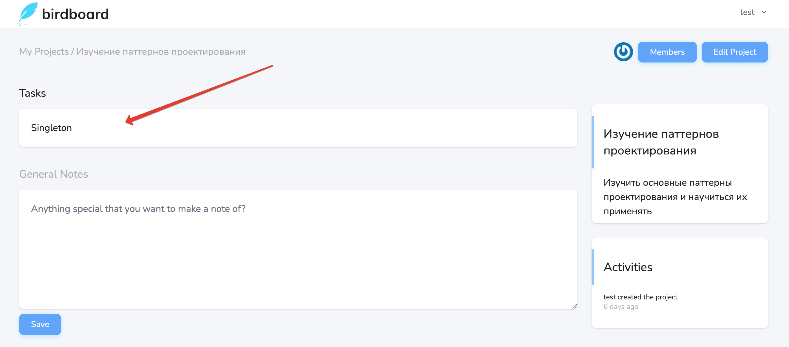
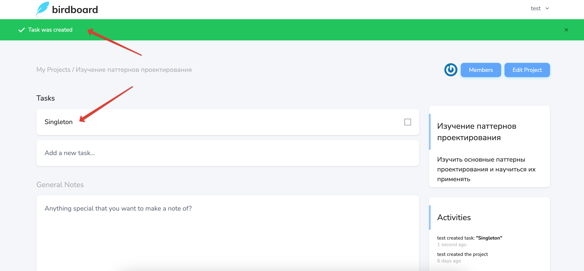
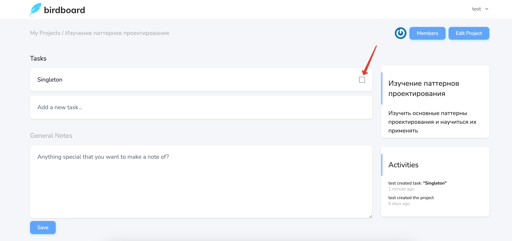
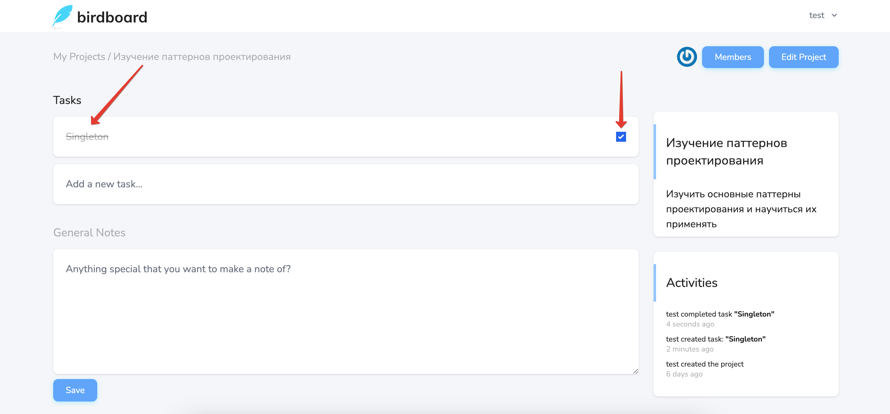

# Управление задачами

Управлять задачами проекта можно на странице [просмотра проекта](../08-view-project/README.md).

Для создания задачи необходимо написать её название и нажать **Enter**:

Задача будет создана:

Задачу можно завершить, нажав на чекбокс справа от её названия:

Завершенная задача будет перечеркнута и чекбокс будет в выбранном состоянии:

Завершенную задачу можно сделать незавершенной повторно кликнув на чекбокс.
