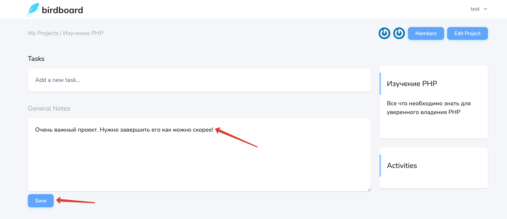

# Заметки проекта

На странице [просмотра проекта](../08-view-project/README.md) можно добавить любую текстовую информацию в качестве заметки:

После сохранения заметки проекта, её можно поменять в любой момент.
