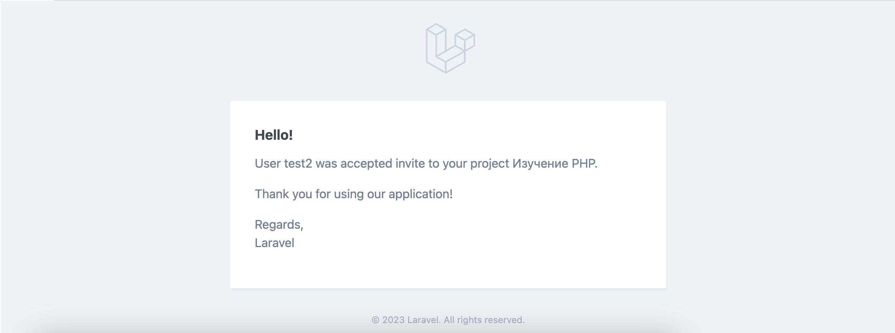

# Страница управления участниками

На странице [просмотра проекта](../08-view-project/README.md) можно перейти на страницу управления участниками проекта:

Здесь в виде списка имен и аватаров указаны участники проекта:

Участника можно исключить из проекта:

Или добавить:

В том или ином случае пользователь получит уведомление на свой email:

Принять или отклонить приглашение в проект можно через специальный раздел профиля пользователя:

Владелец проекта также получит уведомление на свой email в случае того или иного выбора приглашенного пользователя:

Страница управления участниками проекта доступна только её владельцу. Добавлять/удалять участников может также только владелец.

Участник проекта может добавлять задачи, делать их завершенными или незавершенными, и изменять заметки о проекте. Проект, где пользователь является участником, также будут отображен на главной странице вместе с его собственными проектами:

---

[<< Список участников проекта](../11-project-members/README.md) | [Редактирование проекта >>](../13-edit-project/README.md) | [**К оглавлению**](../README.md)
