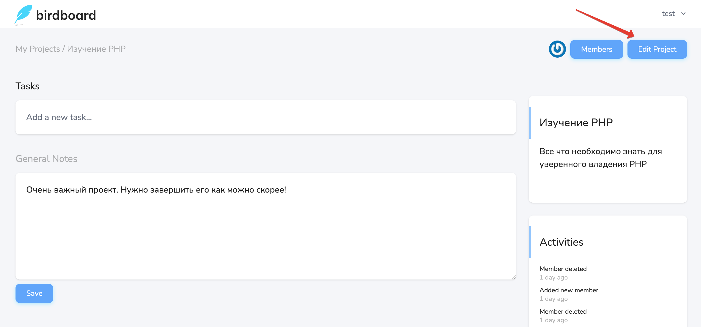
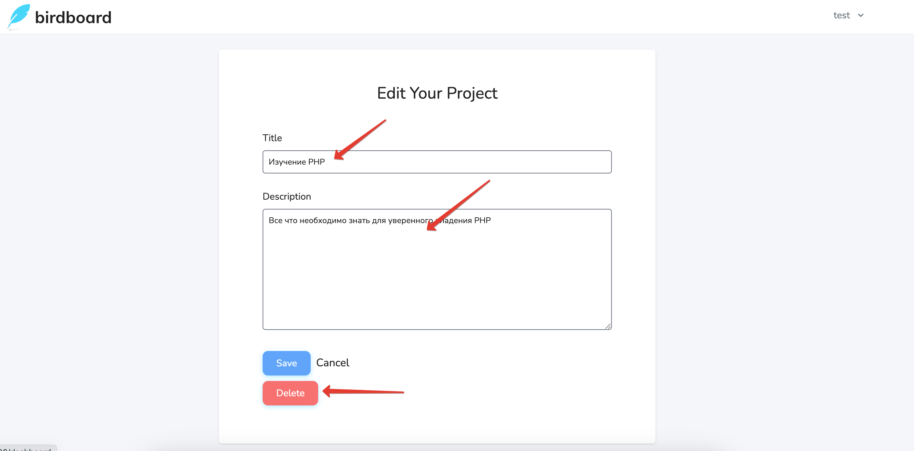

# Редактирование проекта

На странице [просмотра проекта](../08-view-project/README.md) можно перейти на страницу редактирования проекта:

Здесь можно изменить название и описание проекта, а также удалить сам проект:

Страница редактирования проекта доступна только его владельцу.
