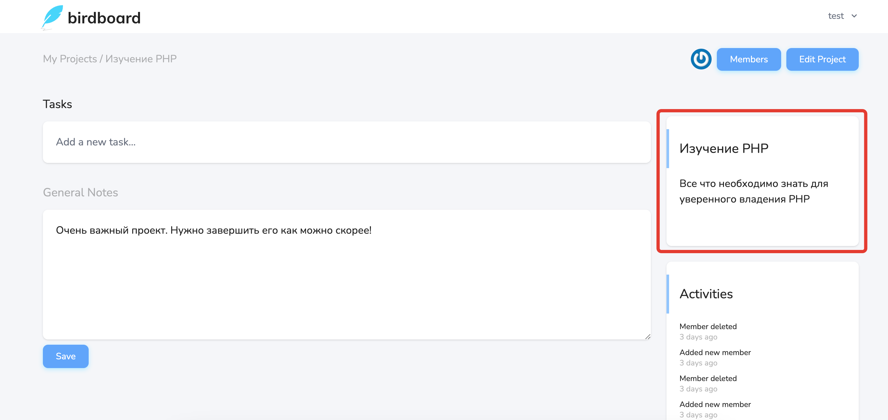

# Описание проекта

На странице [просмотра проекта](../08-view-project/README.md) можно увидеть данные о проекте:

Здесь указаны название и описание проекта, которые были указаны при его создании или редактировании.

---

[<< Страница управления участниками](../13-edit-projects/README.md) | [Активности по проекту >>](../15-project-activities/README.md) | [**К оглавлению**](../README.md)
