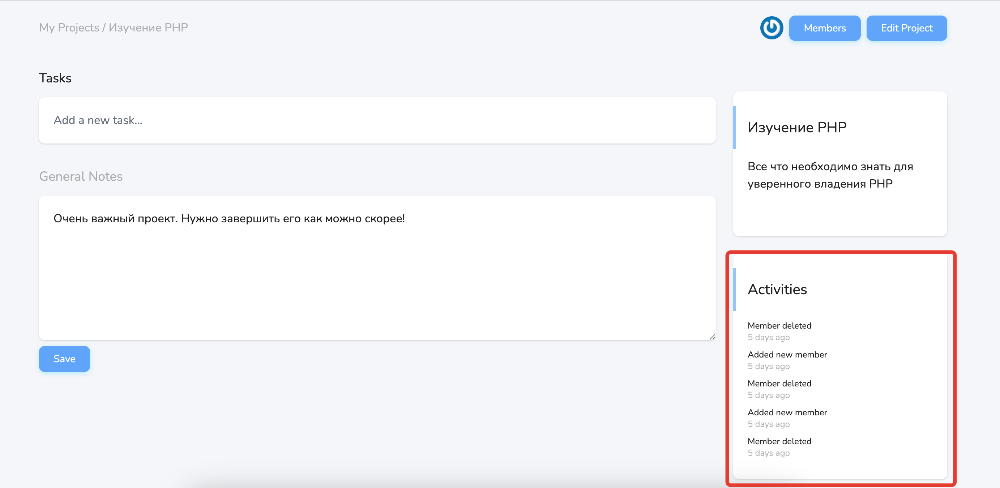

# Активности по проекту

На странице [просмотра проекта](../08-view-project/README.md) можно увидеть данные о действиях, которые происходили с проектом:

Действия, которые фиксируются:

- Создание проекта
- Обновление названия проекта
- Обновление описания проекта
- Обновление заметок проекта
- Добавление задачи
- Изменение задачи
- Завершение задачи
- Отмена завершения задачи
- Добавление участника проекта
- Удаление участника проекта

Для ряда действий отображается старое и новое значения изменения, и автор этого изменения. 
Для каждого действия отображается его дата/время, как давно оно было сделано.

---

[<< Описание проекта](../14-project-description/README.md) | [**К оглавлению**](../README.md)
